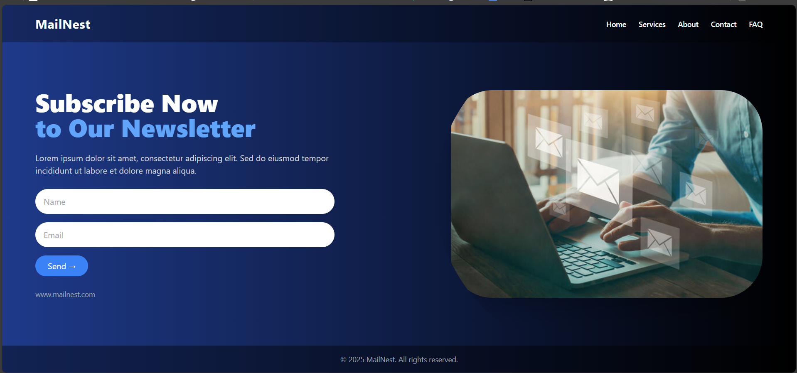

# MailNest – Newsletter Landing Page

This is a responsive newsletter landing page built using **HTML** and **Tailwind CSS**. It was created as part of an internship task to demonstrate skills in layout, responsive design, and form development.

---

## Live Preview

To view the landing page, open `index.html` using [Live Server](https://marketplace.visualstudio.com/items?itemName=ritwickdey.LiveServer) in VS Code or any local server environment.

---

## Features

- Responsive layout using Tailwind CSS  
- Gradient background and modern UI design  
- Hero section with heading, description, and form  
- Name and Email input fields with submit button  
- Clipped and styled image using `clip-path`  
- Fully responsive across devices  
- Clean footer with copyright

---

## Tech Stack

- HTML5  
- Tailwind CSS (via CDN)  
- Local image assets

---

## Folder Structure

landing-page-task/
├── index.html
├── images/
│ ├── hero.jpg
│ └── screenshot.png
└── README.md

---

## Screenshot

> Here's a preview of the final page layout:

---

## How to Run

1. Clone or download this repository  
2. Open in **Visual Studio Code**  
3. Right-click `index.html` and select **"Open with Live Server"**  
4. View the landing page in your browser

---

## Author

**Lavanya Jain**  
Web Development Intern

